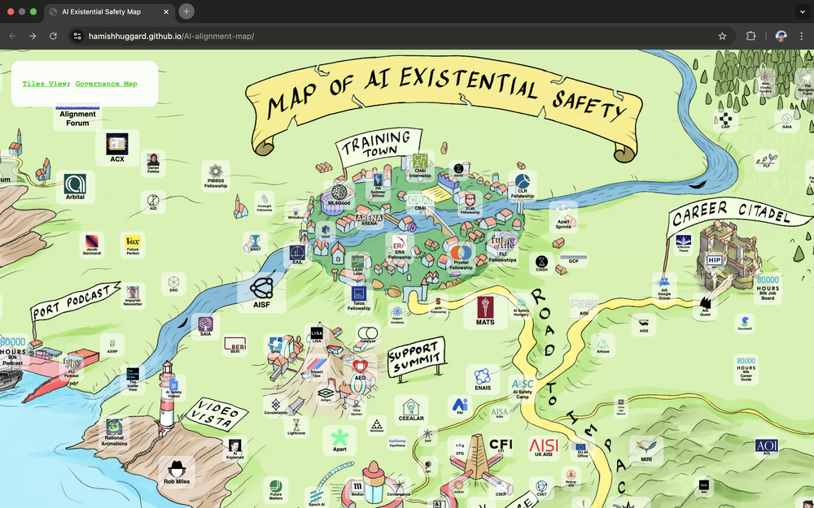

# AI Safety Landscape

A map of organisations, researchers, funders, and trainers in the AI safety landscape.

This was created by Hamish Huggard as a comission for Nonlinear.

Live at: https://hamishhuggard.github.io/AI-alignment-map/

This was previously hosted at [aisafety.world](aisafety.world), but there's now a rebooted version of this project at that address.
